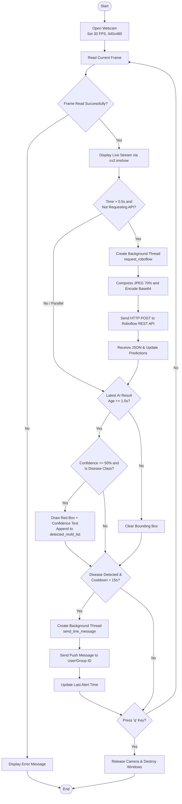

```mermaid
flowchart TD
    Start([Start]) --> Init["Open Webcam\nSet 30 FPS, 640x480"]
    Init --> ReadFrame[Read Current Frame]
    ReadFrame --> CheckRet{Frame Read Successfully?}
    
    CheckRet -- No --> EndErr[Display Error Message] --> End([End])
    
    CheckRet -- Yes --> ShowFrame[Display Live Stream via cv2.imshow]
    
    ShowFrame --> CheckApiTime{"Time > 0.5s and\nNot Requesting API?"}
    
    CheckApiTime -- Yes --> StartThread["Create Background Thread\nrequest_roboflow"]
    StartThread --> Compress["Compress JPEG 70% and Encode Base64"]
    Compress --> CallAPI[Send HTTP POST to Roboflow REST API]
    CallAPI --> RecvJSON["Receive JSON & Update Predictions"]
    
    CheckApiTime -- No / Parallel --> CheckPredTime{"Latest AI Result\nAge <= 1.5s?"}
    RecvJSON --> CheckPredTime
    
    CheckPredTime -- Yes --> FilterConf{"Confidence >= 50% and\nIs Disease Class?"}
    FilterConf -- Yes --> DrawRed["Draw Red Box + Confidence Text\nAppend to detected_mold_list"] --> CheckAlert
    FilterConf -- No --> CheckAlert
    
    CheckPredTime -- No --> ClearBox[Clear Bounding Box] --> CheckAlert
    
    CheckAlert{"Disease Detected &\nCooldown > 15s?"}
    CheckAlert -- Yes --> SendLine["Create Background Thread\nsend_line_message"]
    SendLine --> PushMsg[Send Push Message to User/Group ID] --> UpdateTime[Update Last Alert Time] --> CheckQuit
    CheckAlert -- No --> CheckQuit
    
    CheckQuit{"Press 'q' Key?"}
    CheckQuit -- Yes --> Release[Release Camera & Destroy Windows] --> End
    CheckQuit -- No --> ReadFrame
```
