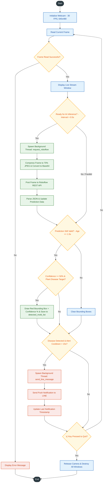

```mermaid
%%{init: {'flowchart': {'curve': 'monotoneY'}}}%%
flowchart TD
    %% Styling Classes
    classDef startEnd fill:#2B3A42,stroke:#1E272C,stroke-width:2px,color:#fff;
    classDef process fill:#E3F2FD,stroke:#1565C0,stroke-width:1.5px,color:#0D47A1;
    classDef decision fill:#FFF8E1,stroke:#FFA000,stroke-width:1.5px,color:#E65100;
    classDef aiProcess fill:#E8F5E9,stroke:#2E7D32,stroke-width:1.5px,color:#1B5E20;
    classDef alertProcess fill:#FBE9E7,stroke:#D84315,stroke-width:1.5px,color:#BF360C;

    %% Main Logic Flow
    Start([Start]):::startEnd --> Init["Initialize Webcam - 30 FPS, 640x480"]:::process
    Init --> ReadFrame["Read Current Frame"]:::process
    ReadFrame --> CheckRet{"Frame Read Successful?"}:::decision
    
    CheckRet -- No --> EndErr["Display Error Message"]:::alertProcess --> End([End]):::startEnd
    
    CheckRet -- Yes --> ShowFrame["Display Live Stream Window"]:::process
    ShowFrame --> CheckApiTime{"Ready for AI Inference? - Interval > 0.5s"}:::decision
    
    %% API Process Block
    CheckApiTime -- Yes --> StartThread["Spawn Background Thread: request_roboflow"]:::aiProcess
    StartThread --> Compress["Compress Frame to 70% JPEG & Convert to Base64"]:::aiProcess
    Compress --> CallAPI["Post Frame to Roboflow REST API"]:::aiProcess
    CallAPI --> RecvJSON["Parse JSON & Update Prediction Data"]:::aiProcess
    RecvJSON --> CheckPredTime
    
    CheckApiTime -- No / Parallel --> CheckPredTime{"Prediction Still Valid? - Age <= 1.5s"}:::decision
    
    %% Bounding Box Render
    CheckPredTime -- Yes --> FilterConf{"Confidence >= 50% & Plant Disease Target?"}:::decision
    FilterConf -- Yes --> DrawRed["Draw Red Bounding Box + Confidence % & Save to detected_mold_list"]:::aiProcess --> CheckAlert
    FilterConf -- No --> CheckAlert
    
    CheckPredTime -- No --> ClearBox["Clear Bounding Boxes"]:::process --> CheckAlert
    
    %% LINE Notification Block
    CheckAlert{"Disease Detected & Alert Cooldown > 15s?"}:::decision
    CheckAlert -- Yes --> SendLine["Spawn Background Thread: send_line_message"]:::alertProcess
    SendLine --> PushMsg["Send Push Notification to LINE"]:::alertProcess
    PushMsg --> UpdateTime["Update Last Notification Timestamp"]:::alertProcess --> CheckQuit
    
    CheckAlert -- No --> CheckQuit
    
    %% Exit Check
    CheckQuit{"'q' Key Pressed to Quit?"}:::decision
    CheckQuit -- Yes --> Release["Release Camera & Destroy All Windows"]:::process --> End
    CheckQuit -- No --> ReadFrame
```
