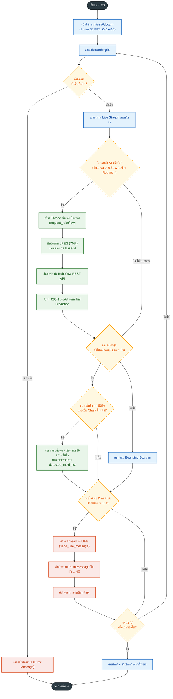

```mermaid
flowchart TD
    %% Styling Classes
    classDef startEnd fill:#2B3A42,stroke:#1E272C,stroke-width:2px,color:#fff;
    classDef process fill:#E3F2FD,stroke:#1565C0,stroke-width:1.5px,color:#0D47A1;
    classDef decision fill:#FFF8E1,stroke:#FFA000,stroke-width:1.5px,color:#E65100;
    classDef aiProcess fill:#E8F5E9,stroke:#2E7D32,stroke-width:1.5px,color:#1B5E20;
    classDef alertProcess fill:#FBE9E7,stroke:#D84315,stroke-width:1.5px,color:#BF360C;

    %% Main Logic Flow
    Start([เริ่มต้นทำงาน]):::startEnd --> Init["เปิดใช้งานกล้อง Webcam<br/>(กำหนด 30 FPS, 640x480)"]:::process
    Init --> ReadFrame["อ่านเฟรมภาพปัจจุบัน"]:::process
    ReadFrame --> CheckRet{"อ่านภาพ<br/>สำเร็จหรือไม่?"}:::decision
    
    CheckRet -- ไม่สำเร็จ --> EndErr["แสดงข้อผิดพลาด (Error Message)"]:::alertProcess --> End([จบการทำงาน]):::startEnd
    
    CheckRet -- สำเร็จ --> ShowFrame["แสดงภาพ Live Stream บนหน้าจอ"]:::process
    ShowFrame --> CheckApiTime{"ถึงเวลาส่ง AI หรือยัง?<br/>( interval > 0.5s & ไม่ค้าง Request )"}:::decision
    
    %% API Thread Block
    CheckApiTime -- ใช่ --> StartThread["สร้าง Thread ทำงานเบื้องหลัง<br/>(request_roboflow)"]:::aiProcess
    StartThread --> Compress["บีบอัดภาพ JPEG (70%)<br/>และแปลงเป็น Base64"]:::aiProcess
    Compress --> CallAPI["ส่งภาพไปยัง Roboflow REST API"]:::aiProcess
    CallAPI --> RecvJSON["รับค่า JSON และอัปเดตผลลัพธ์ Prediction"]:::aiProcess
    RecvJSON --> CheckPredTime
    
    CheckApiTime -- ไม่ใช่/ทำขนาน --> CheckPredTime{"ผล AI ล่าสุด<br/>ยังไม่หมดอายุ? (<= 1.5s)"}:::decision
    
    %% Bounding Box Render
    CheckPredTime -- ใช่ --> FilterConf{"ความมั่นใจ >= 50%<br/>และเป็น Class โรคพืช?"}:::decision
    FilterConf -- ใช่ --> DrawRed["วาด กรอบสีแดง + ข้อความ % ความมั่นใจ<br/>บันทึกเข้ารายการ detected_mold_list"]:::aiProcess --> CheckAlert
    FilterConf -- ไม่ใช่ --> CheckAlert
    
    CheckPredTime -- ไม่ใช่ --> ClearBox["ลบกรอบ Bounding Box ออก"]:::process --> CheckAlert
    
    %% LINE Notification Block
    CheckAlert{"พบโรคพืช & คูลดาวน์<br/>แจ้งเตือน > 15s?"}:::decision
    CheckAlert -- ใช่ --> SendLine["สร้าง Thread ส่ง LINE<br/>(send_line_message)"]:::alertProcess
    SendLine --> PushMsg["ส่งข้อความ Push Message ไปยัง LINE"]:::alertProcess
    PushMsg --> UpdateTime["อัปเดตเวลาแจ้งเตือนล่าสุด"]:::alertProcess --> CheckQuit
    
    CheckAlert -- ไม่ใช่ --> CheckQuit
    
    %% Exit Check
    CheckQuit{"กดปุ่ม 'q'<br/>เพื่อเลิกหรือไม่?"}:::decision
    CheckQuit -- ใช่ --> Release["คืนค่ากล้อง & ปิดหน้าต่างทั้งหมด"]:::process --> End
    CheckQuit -- ไม่ใช่ --> ReadFrame
```
