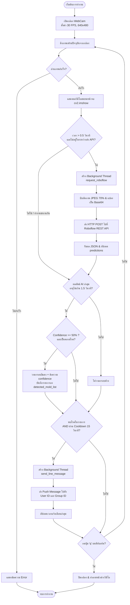

```mermaid
flowchart TD
    Start([เริ่มต้นการทำงาน]) --> Init["เปิดกล้อง WebCam\nตั้งค่า 30 FPS, 640x480"]
    Init --> ReadFrame[ดึงภาพเฟรมปัจจุบันจากกล้อง]
    ReadFrame --> CheckRet{อ่านภาพสำเร็จ?}
    
    CheckRet -- ไม่สำเร็จ --> EndErr[แสดงข้อความ Error] --> End([จบการทำงาน])
    
    CheckRet -- สำเร็จ --> ShowFrame[แสดงผลวิดีโอสดบนหน้าจอ cv2.imshow]
    
    ShowFrame --> CheckApiTime{"เวลา > 0.5 วินาที\nและไม่อยู่ในระหว่างส่ง API?"}
    
    CheckApiTime -- ใช่ --> StartThread["สร้าง Background Thread\nrequest_roboflow"]
    StartThread --> Compress["บีบอัดภาพ JPEG 70% & แปลงเป็น Base64"]
    Compress --> CallAPI[ส่ง HTTP POST ไปที่ Roboflow REST API]
    CallAPI --> RecvJSON["รับผล JSON & อัปเดต predictions"]
    
    CheckApiTime -- ไม่ใช่ / ทำงานขนานกัน --> CheckPredTime{"ผลลัพธ์ AI ล่าสุด\nอายุไม่เกิน 1.5 วินาที?"}
    RecvJSON --> CheckPredTime
    
    CheckPredTime -- ใช่ --> FilterConf{"Confidence >= 50% ?\nและเป็นคลาสโรค?"}
    FilterConf -- ใช่ --> DrawRed["วาดกรอบสีแดง + ข้อความ confidence\nบันทึกรายการลง detected_mold_list"] --> CheckAlert
    FilterConf -- ไม่ใช่ --> CheckAlert
    
    CheckPredTime -- ไม่ใช่ --> ClearBox[ไม่วาดกรอบค้าง] --> CheckAlert
    
    CheckAlert{"พบโรคในรายการ\nAND ผ่าน Cooldown 15 วินาที?"}
    CheckAlert -- ใช่ --> SendLine["สร้าง Background Thread\nsend_line_message"]
    SendLine --> PushMsg[ส่ง Push Message ไปยัง User ID และ Group ID] --> UpdateTime[อัปเดตเวลาแจ้งเตือนล่าสุด] --> CheckQuit
    CheckAlert -- ไม่ใช่ --> CheckQuit
    
    CheckQuit{"กดปุ่ม 'q' บนคีย์บอร์ด?"}
    CheckQuit -- ใช่ --> Release["ปิดกล้อง & ทำลายหน้าต่างวิดีโอ"] --> End
    CheckQuit -- ไม่ใช่ --> ReadFrame
```
